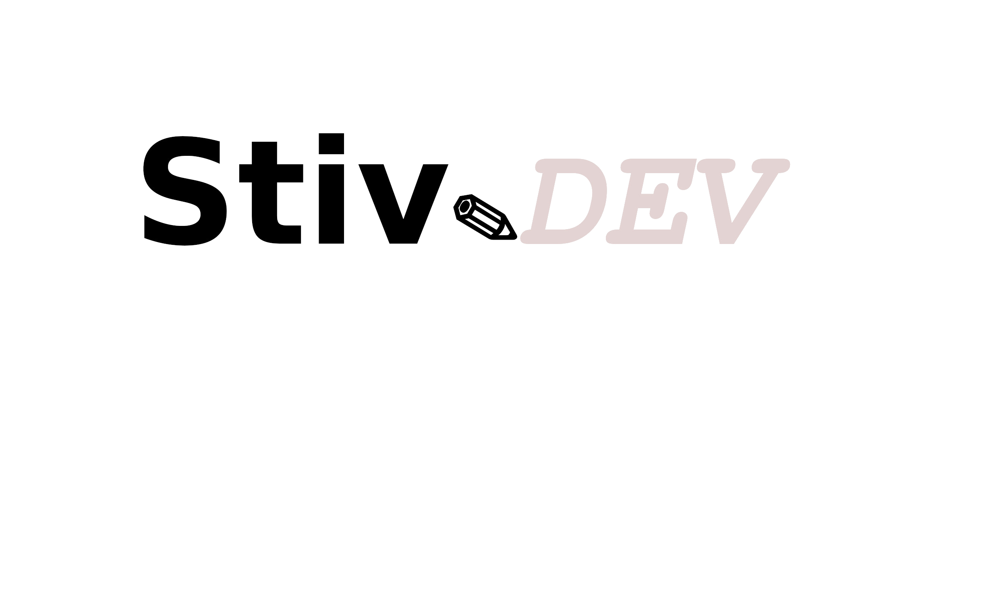

<a href="https://github.com/KenethSandoval"></img></a>

## Desarrollador de software 💻
 
Desarrollador independiente. Me gusta aprender nuevas tecnologias, fanatico del código abierto, extender y compartir mi conocimiento y la automatización.
 

* Explorando tecnologias nuevas
* Me gusta colaborar en proyectos de codigo abierto.

### Lenguajes
* Javascript
* Typescript
* C++, C
* Python
* Go

Y el control de tecnologias como Git, Github, NodeJS, Angular 5+, NoSQL, Mysql, JWT, HTTP, etc.

**Contáctame**
* 📫 kenethra.74@gmail.com
* 📈 www.linkedin.com/in/keneth-sandoval-284595179

